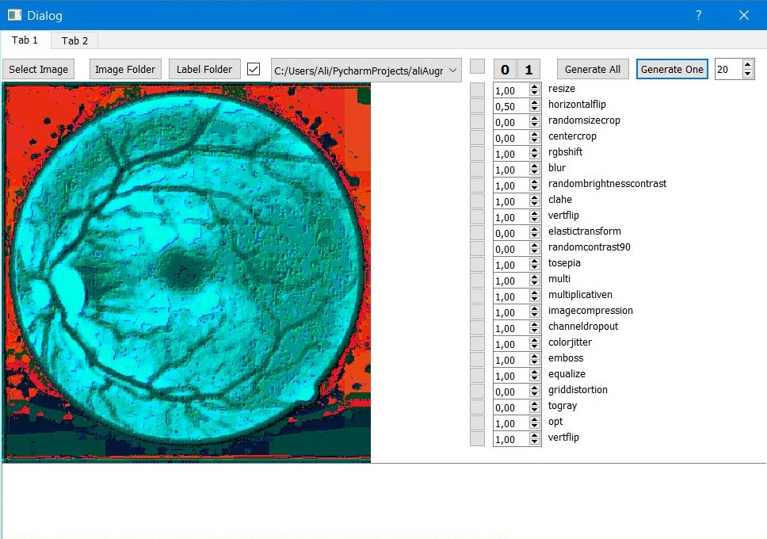
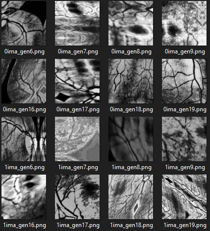
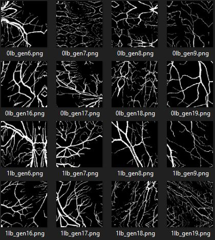

# bestAugmentator
## The app is working at the moment just for 1 image, but the script is working with folders and labels :) 

I'm going to work on the best data Augmentator, and use this application in CV

Things that I will use here:
* OPENCV
* C++ ( I'm not sure, cuz with Python is going to be easier)
* Qt
* albumentations
* We are going to also use labels

The main idea is to create a appliacation that will help us to select the parameters for our augmentation. 
We will be able to visualize what is happening to our image before doing to for loop. We are going to have a lot of filters and transformation and there is going 
to be a checkbox for each.

### Select Image: Pic just One Image
### Image Folder: Select a folder that contains the images for the augmentation. It will find [*.jpg,*.png,*.jpeg]
### Label Folder: Select a folder that contains the labels for the augmentation. It will find [*.jpg,*.png,*.jpeg] 

If u want to do the augmentation, u have tu check the checkbox infront of the Label Folder.
U can also select the current image.
U can set a probability to apply a filter.
All the filters can be checked toghether or u can check just One of the clicking on the correspondig button.

### Generate All: will do the aumentation for all the images in the folder
### Generate One: Just one image ( The current selected) will be augmented.
#### Both buttuns will ask u for the the folder where you want to save the aumented images, if the labeling is enabled, it will ask for another folder to save the labels.

## The script for the data augmentation is almost done:

Script: augwithlabel.py

Dataset: [DRIVE: Digital Retinal Images for Vessel Extraction](https://drive.grand-challenge.org/)

IMAGES   GENERATED         |  LABEL GENERATED
:-------------------------:|:-------------------------:
           |  

