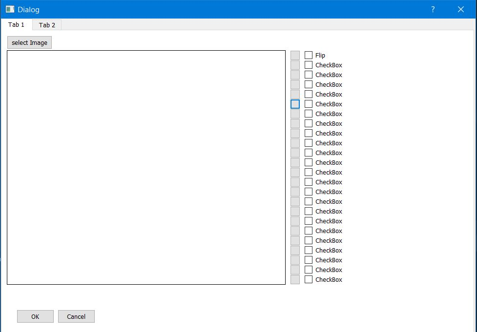

# bestAugmentator

I'm going to work on the best data Augmentator, and use this application in CV

Things that I will use here:
* OPENCV
* C++ ( I'm not sure, cuz with Python is going to be easier)
* Qt
* albumentations

The main idea is to create a appliacation that will help us to select the parameters for our augmentation. 
We will be able to visualize what is happening to our image before doing to for loop. We are going to have a lot of filters and transformation and there is going 
to be a checkbox for each.

